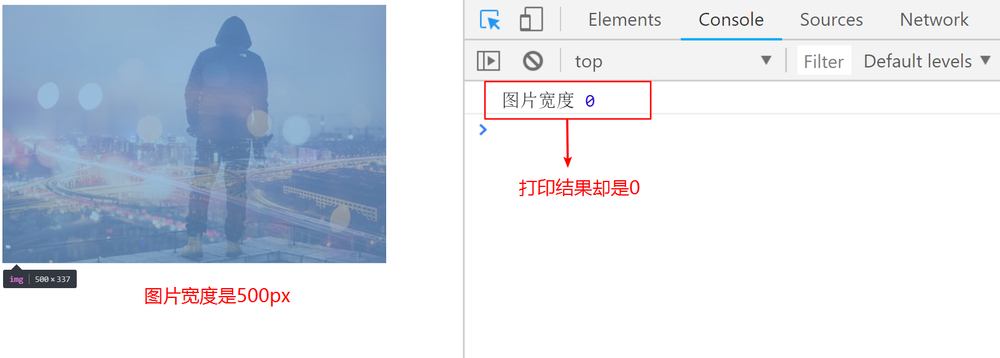
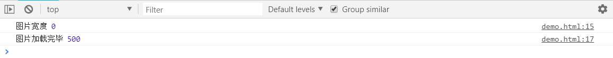

# 异步-代码烧脑的原因
## 同步与异步
同步：等待结果  
异步：不等待结果

**异步常常伴随回调一起出现，但是异步不是回调，回调也不一定是异步**
```js
// 同步的sleep
function sleep(seconds) {
  var start = new Date();
  for(;new Date() - start < seconds * 1000;) {

  }
}
console.log(1);
sleep(3);
console.log('wake up');
console.log(2);
```

```js
// 异步的sleep
function sleep(seconds,fn) {
  setTimeout(fn,seconds*1000)
}
console.log(1);
sleep(3,() => console.log('weak up'));
console.log(2);
```

## 前端经常遇到的异步
### 1. 图片加载
图片加载是需要时间的，但它并不会阻塞后续代码的执行，即：图片加载是异步的
```html

```
```js
const img = document.getElementsByTagName('img')[0];
console.log(img.width);
```


解决方法：当图片加载完毕后再获取宽度
```js
const img = document.getElementByTagName('img')[0];
console.log('图片宽度',img.width);
img.onload = function() {
  console.log('图片加载完毕',img.width);
}
```


### 面试
```html
<div id="box">
  <ul>
    <li>选项1</li>
    <li>选项2</li>
    <li>选项3</li>
    <li>选项4</li>
    <li>选项5</li>
    <li>选项6</li>
  </ul>
</div>
```
```js
let liList = document.querySelectorAll('li');
// 这里i会变量声明提升，是全局变量
for(var  i=0;i<liList.length;i++) {
  liList.onclick = function() {
    console.log(i); // 6
  }
}
```

### `Ajax`中的异步

## 获取异步结果的技巧
