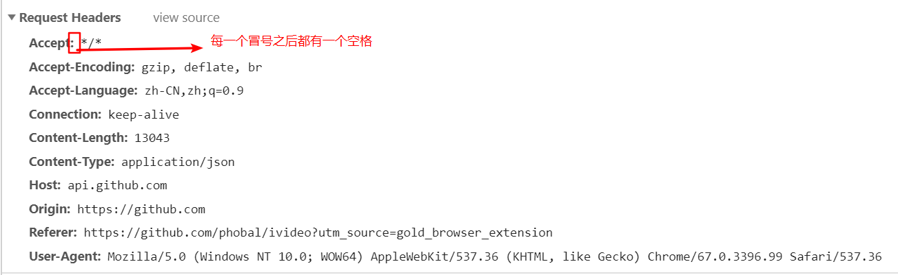

## 请求
> HTTP的请求报文分为三个部分：请求行，请求头，请求体  

MIME类型：是一种标准化的方式来表示文档的性质和格式。浏览器通常使用`MIME`类型（而不是文件扩展名）来确定如何处理文档；因此服务器设置正确以将正确的MIME类型附加到响应对象的头部是非常重要的。 
**常见的MIME类型**
扩展名|类型/子类型
-|-
html|text/html
css|text/css
js|application/javascript
json|application/json
txt|application/plain
jpg|image/jpeg

### 1. 请求行
请求行(Request line)分为3个部分：**请求方法**、**请求地址**和**协议版本号**  
请求行示例：  
* 请求方法：POST  
* 请求地址：_private/browser/stats
* 协议版本号：HTTP/1.1
  

### 2. 请求头
请求头可以用于传递一些附加信息，格式为: `键：值`  
请求头示例：  
    

**请求和响应常见的`Header`**
名称|作用
-|-
Content-Type|请求体/响应体的类型，如：text/plain、application/json
Accept|说明接收的类型，可以多个值，用`,`（英文逗号）分开
Content-Length|请求体/响应体的长度，单位字节
Content-Encoding|请求体/响应体的编码格式，如gzip、deflate
Accept-Encoding|告知对方我方接收的Content-Encoding
Etag|给当前资源的标识，和`Last-Modified`,`If-None-Match`,`If-Modified-Since`配合，用于缓存控制
Cache-control|取值一般为`no-cache`,`max-age=xx`,xx为整数，表示资源缓存有效期（秒）

**常见的请求`Header`**
名称|作用
-|-
Authorization|用于设置身份认证信息
User-Agent|用户标识，如：OS和浏览器的类型和版本
If-Modified-Since|值为上一次服务器返回的`Last-Modified`值，用于确定某个资源是否被更改过，没有更改过就从缓存中读取
If-None-Match|值为上一次服务器返回的ETag值，一般会和`If-Modified-Since`结合使用
Cookie|已有的`Cookie`
Referer|标识请求引用自哪个地址，比如你从页面A跳转到页面B时，值为页面A的地址
Host|请求的主机和端口号

## 响应
