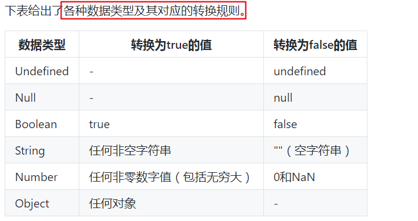
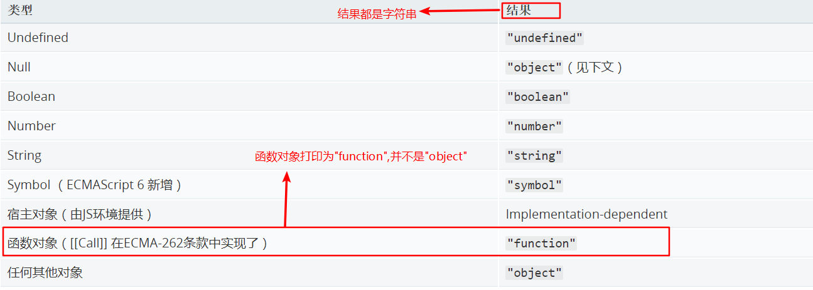

### js数据类型
1. **Number**(数字)
2. **String**(字符串)
3. **Boolean**(布尔)
4. **Symbol**(符号，第六版新增)
5. **Object(对象)**
    1. function(函数)
    2. Array(数组)
    3. Date(日期)
    4. RegExp(正则表达式)
6. **null**(空)
7. **undefined**(未定义)

**`var`声明变量但未对其初始化时,这个变量的值就是`undefined`,直接使用未声明的变量会产生错误。对未声明或已声明但未初始化的变量执行`typeof`运算符会返回`undefined`值**
```js
var message; // 这个变量声明之后默认取得了`undefined`值
// var age; // 这个变量并没有声明
console.log(message); // "undefined"
console.log(age); // 报错

console.log(typeof message); // "undefined"
console.log(typeof age); // "undefined"
```

<font color="red">转换为boolean值</font>

### 数据类型检测
>推荐阅读：[JavaScript检测原始值、引用值、属性](http://shijiajie.com/2016/06/20/javascript-maintainable-javascript-validate1/)
#### 1. [`typeof`运算符](https://developer.mozilla.org/zh-CN/docs/Web/JavaScript/Reference/Operators/typeof)

* `typeof`是一个运算符而不是函数
  ```js
  const message = "some string";

  console.log(typeof message); // "string"  推荐写法
  // "string" typeof是一个运算符，不推荐这样写
  console.log(typeof(message));
  console.log(typeof 95); // "number"
  ```
* 如果值未声明或已声明但未初始化:`undefined`
  ```js
  // 值未声明并不会报错，而是undefined
  console.log(typeof aaa); // "undefined"
  ```
* 如果值为函数：`function`
  ```js
  function fn() {
    console.log("我是函数");
  }
  console.log(typeof fn); // "function"
  ```
* 杜绝使用`typeof`来检测`null`的类型
#### 2. [`instanceof`运算符](https://developer.mozilla.org/zh-CN/docs/Web/JavaScript/Reference/Operators/instanceof)
#### 3. [`Object.toString.call()`](https://developer.mozilla.org/zh-CN/docs/Web/JavaScript/Reference/Global_Objects/Object/toString)
#### 4. [`Array.isArray()`](https://developer.mozilla.org/zh-CN/docs/Web/JavaScript/Reference/Global_Objects/Array/isArray)

### 判断属性是否存在
判断属性是否存在的最好的方法是使用`in`运算符。
