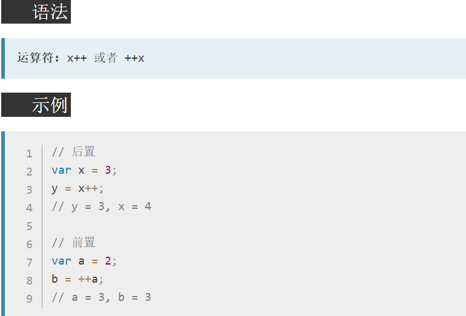
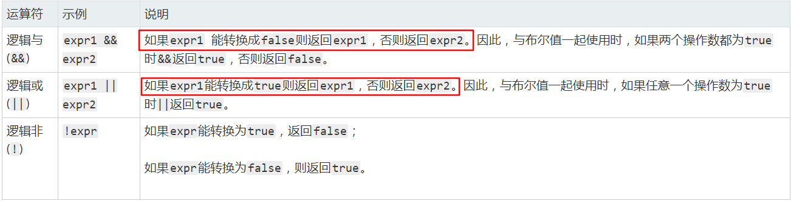

## 运算符
* 一些运算符是由关键字表示的，如:`typeof`,`instanceof`
* `delete`运算符用来删除对象属性或数组元素，如果删除成功或所删除的目标不存在，`delete`将返回`true`。
* 乘性运算符：乘法、除法和求模。在操作数为非数值的情况下会执行自动的类型转换，使用Number()转型函数将其转换为数值。即：空字符串将被当做0，布尔值true将被当做1。
* undefined转换为number类型为NaN,null转换为number类型为0
* ==和!=这俩个运算符都会进行强制类型转换,然后再比较它们的相等性
* `null`和`undefined`是相等的。在比较相等性之前，不能将`null`和`undefined`转换成其它任何值。

### 等值运算符
  ```js
  // null和undefined是相等的
  // 在比较相等性之前，不能将null和undefined转换成其它任何值
  null == undefined // true
  "NaN" == NaN // false,NaN和任何值都不相等

  // boolean值在比较相等性之前会先转换为数值
  false == 0  // true
  true == 1   // true

  // null和undefined在比较相等性之前不会强制类型转换
  undefined == 0 // false
  null == 0 // false

  // 一个为数字，一个为字符串，字符串会转化为数字
  "5" == 5 // true
  ```
### 关系运算符
  ```js
  // 如果俩个操作数都是字符串,则比较俩个字符串对应的字符编码值
  var result1 = "23" < "3" // true
  // 如果一个操作数是数值,则将另一个操作数转换为数值进行比较
  var result2 = "23" < 3 // false
  ```
* [`in`运算符](https://developer.mozilla.org/zh-CN/docs/Web/JavaScript/Reference/Operators/in):如果指定的属性在指定的对象或其原型链中,则in运算符返回true。 语法： prop in object
  ```js
  const trees = ["redwood","bay","cedar","oak","maple"];
  0 in trees // true;
  // 索引值相当于对象的键值既可以写为字符串形式，也可以不加'',或""
  "2" in trees // true;
  2 in trees // true
  // toString是从原型上继承来的
  "toString" in trees // true
  ```
### 逻辑运算符

