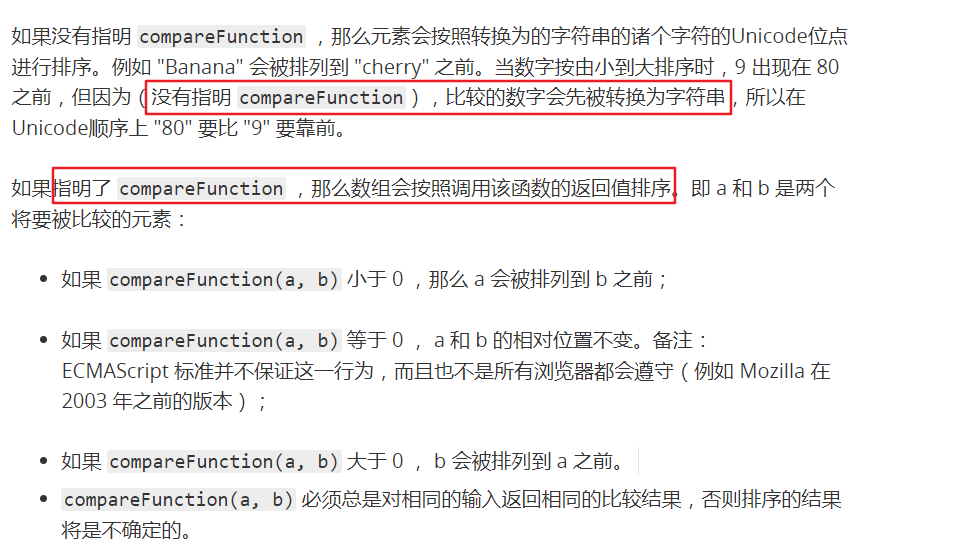
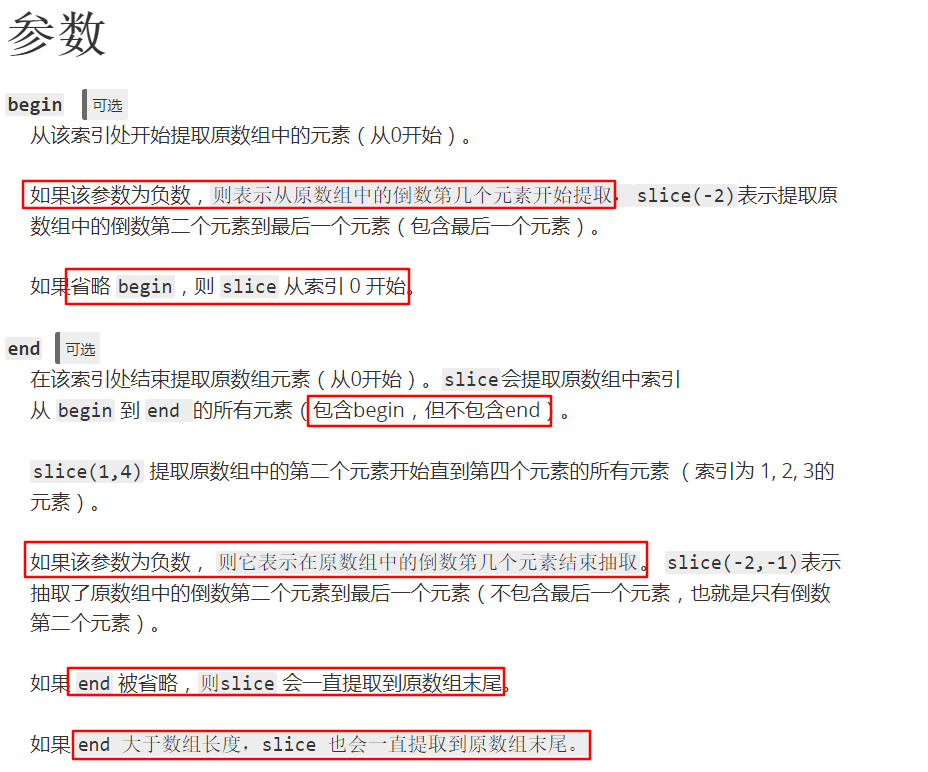
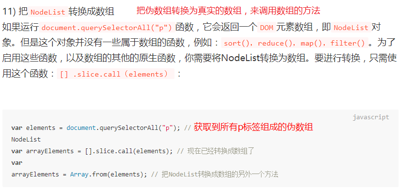
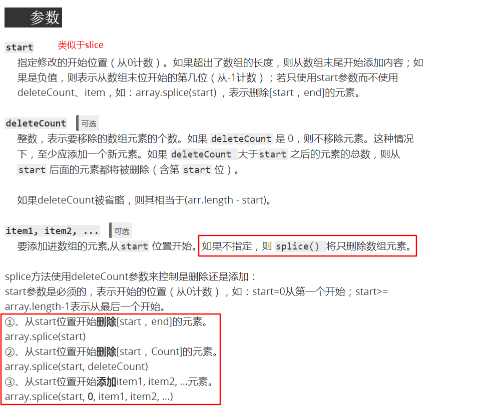
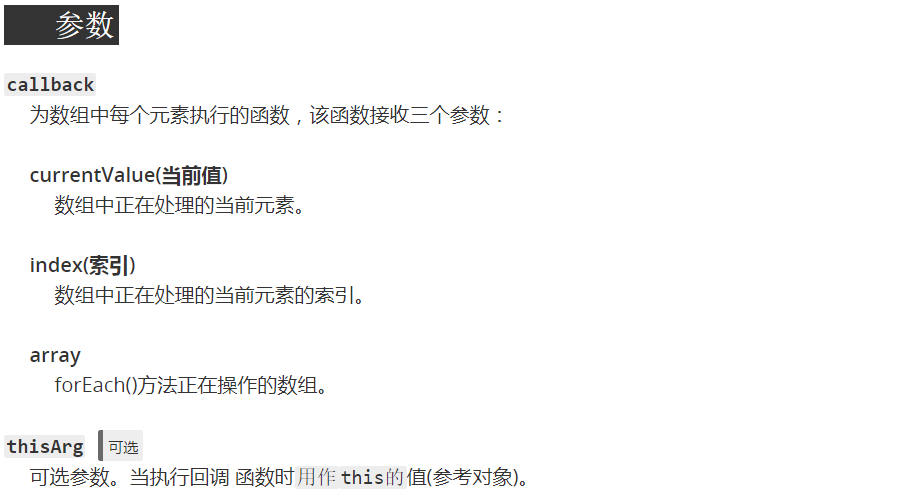
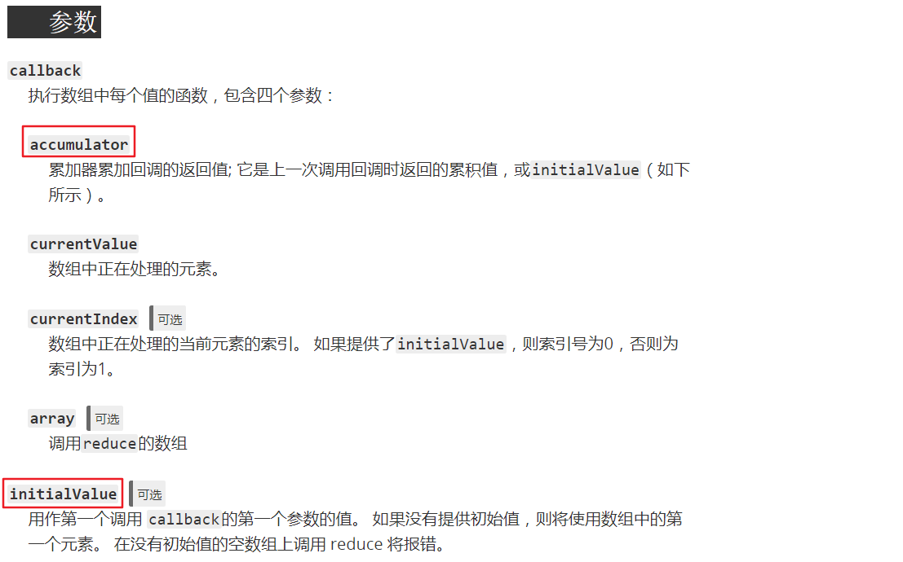

## [数组](http://javascript.ruanyifeng.com/grammar/array.html)
> JavaScript数组是javaScript对象的特殊形式，数组索引实际上和碰巧是整数的属性名差不多。
> 通常，数组的实现是经过优化的，用数字索引来访问数组元素一般来说比访问常规的对象属性要快很多。

**本质上，数组属于特殊的对象**
```js
var arr = ['a','b','c'];
// JavaScript语言规定，对象的键名一律为字符串
arr[0] = 'a'; // 可以用数值读取，非字符串的键名会被转换为字符串
arr.0 // 报错，会认为是小数点
arr['1'] = 'b';
Object.keys(arr); // ["0","1","2"]
```
### 创建数组
> 1. 使用数组字面量
> 2. `new`关键字来创建数组

#### 数组字面量（推荐）
数组直接量中的值不一定要是常量，可以是任意的表达式
```js
var empty = []; // 空数组
var base = 1024;
var table = [ base, base+1, base+2, base+3];
// 任何类型的数据，都可以放入数组
var arr = [ {a:1},"hello world", [1,2,3], function() { return true; } ]
```
#### 使用`new`关键字
通过`new`关键字调用构造函数`Array()`创建数组，可以用三种方式调用构造函数
```js
// 调用时没有参数
var arr = new Array();
console.log(arr); // []

// 调用时有一个数值参数，它指定长度
var arr = new Array(10);
console.log(arr); // [empty x 10] 数组的长度为10，每一项为undefined

// 显示指定多个数组元素或者数组的一个非数值元素
var arr = new Array(5,4,3,2,1,"testing");
console.log(arr); // [5,4,3,2,1,"testing"]
```
### 稀疏数组
> 如果你确实遇到了稀疏数组，你的代码很可能像对待非稀疏数组一样来对待它们，只不过包含一些`undefined`值。
稀疏数组就是包含从0开始的不连续索引的数组。通常，数组的`length`属性值代表数组中元素的个数。如果数组是稀疏的，`length`属性值大于元素的个数。可以用`Array()`构造函数或简单的指定数组的索引值大于当前的数组长度来创建稀疏数组。
```js
var arr = new Array(5) // 数组没有元素，但是arr.length = 5;

var arr = []; // 创建一个空数组，arr.length = 0;
arr[1000] = 0; // 添加一个元素，arr.length被自动更新为10001;
```

当省略数组直接量中的值时（使用连续的逗号，比如[1,,3]）,这时得到的数组也是稀疏数组，**省略掉的值是不存在的**
```js
var a1 = [,'1','2']; // 此数组长度是3
var a2 = [undefined] // 此数组包含一个值为undefined的元素
console.log(0 in a1); // false, a1在索引0出没有元素
console.log(0 in a2); // true, a2在索引0处有一个值为`undefined`的元素
```

### 数组的长度
> 每一个数组有一个`length`属性，这个属性使其区别于常规的`JavaScript`对象。针对稠密（非稀疏）数组，`length`属性值代表数组中元素的个数。其值比数组中最大的索引大1。

数组的俩个特殊行为：
  * 如果为一个数组元素赋值，它的索引i大于或等于现有数组的长度时，`length`属性的值将设置为`i+1`.
  * 设置`length`属性为一个小于当前长度的非负整数`n`时，当前数组中那些索引值大于或等于`n`的元素将从中删除。
```js
var a = [1,2,3,4,5];
a.length = 3;
console.log(a); // [1,2,3];

a.length = 0; // 删除所有元素
console.log(a); // [] (空数组)

a.length = 5; // 长度为5，但是没有元素，相当于new Array(5)
```
通过`length`属性为数组末尾添加一个元素
```js
var a = [1,3,5];
a[a.length] = 7;
console.log(a); // [1,3,5,7]
```
> 在ECMAScript5中，可以用[`Object.defineProperty()`](https://developer.mozilla.org/zh-CN/docs/Web/JavaScript/Reference/Global_Objects/Object/defineProperty)让数组的`length`属性变成只读的。

### 数组元素的删除和添加
添加数组元素最简单的方法,为新索引赋值
```js
var a = [];  // 开始是一个空数组
a[0] = "zero"; // 向其中添加一个元素
a[1] = "one";
a[a.length] = a.length; // 为数组的最后一项赋值
console.log(a); // ["zero","one",2]
```

可以像删除对象属性一样使用`delete`运算符来删除数组元素
```js
var a = [1,2,3];
delete a[1] // a在索引1的位置不在有元素
1 in a      // => false:数组索引并未在数组中定义
a.length    // => 3: delete操作符并不影响数组长度
```

### 数组遍历
题目：将一个对象的键名放入到一个数组中
```js
var obj = { name:'小明', age:'18', sex:'男',height:'167cm' };
var keys = Object.keys(obj);
var values = [];
for(var i=0; i<keys.length; i++) {
  values[i] = obj[keys[i]];
}

// 数组的长度只需要查询一次，而不必每次都查询
// 优化
for(var i=0, len=keys.length; i<len; i++) {
  // 循环体
}
```

这些例子假设数组是稠密的，并且所有的数据都是合法数据。否则，使用数组元素之前应该先检测它们
```js
for(var i=0;i<a.length;i++) {
  if(!a[i]) continue; // 跳过null,undefined和不存在的元素，但内容为0的元素也会跳过
  if(!(i in a)) continue; // 跳过不存在的元素，null、undefined、0都不会跳过
  if(a[i] === undefined) continue;  // 跳过undefined元素和不存在的元素（不存在的元素默认为undefined）
  // 循环体
}
```

### 数组检测
> 给定一个未知的对象，判断它是否为数组

通过Array.isArray()函数来进行判断
```js
Array.isArray([]); // true
Array.isArray({}); // false
```

通过`instaceof`实现
```js
[] instanceof Array;  // true
({}) instanceof Array; // false
```
`instanceof`的问题在于Web浏览器中有可能有多个窗体存在。每个窗体都有自己的`JavaScript`环境，有自己的全局对象，每个全局对象有自己的一组构造函数。因此，一个窗体中的对象将不可能是另外窗体中的构造函数的实例。

`isArray()`函数的代码实现
```js
var isArray = Array.isArray || function(o) {
  return typeof o === 'object' && Object.prototype.toString.call(o) === '[object Array]'
}
```

### [数组常用方法](https://developer.mozilla.org/zh-CN/docs/Web/JavaScript/Reference/Global_Objects/Array/prototype)
#### 转换方法
`valueOf()`方法返回指定对象的原始值。该方法通常由JavaScript在后台自动调用，并不显示地出现在代码中。

`toString()`方法返回一个字符串,表示指定的数组及其元素.
```js
var monthNames = ["Jan","Feb","Mar","Apr"];
var myVar = monthNames.toString(); 
console.log(myVar); // "Jan","Feb","Mar","Apr"
```

`toLocaleString()`方法返回一个字符串表示数组中的元素。数组中的元素将使用各自的`tolocaleString()`方法转成字符串,这些字符串将使用一个特定语言环境的字符串（例如一个逗号","）隔开。

[`join()`](https://developer.mozilla.org/zh-CN/docs/Web/JavaScript/Reference/Global_Objects/Array/join)方法将一个数组（或类数组对象）的所有元素连接成一个字符串并返回这个字符串。不会改变原数组。
```js
const a = ["Wind", "Rain", "Fire"];
console.log(a.join()); // 不传参数默认为逗号","连接
// "Wind,Rain,Fire"
console.log(a.join("")); // 分隔符 === 空字符串 ""
// "WindRainFire"
console.log(a.join(" ")); // 通过空格进行连接
// "Wind Rain Fire"
console.log(a.join("-")); // 分隔符 "-"
// "Wind-Rain-Fire"
```

#### 栈方法和队列方法（会改变原数组）
[`pop()`](https://developer.mozilla.org/zh-CN/docs/Web/JavaScript/Reference/Global_Objects/Array/pop)方法从数组中删除最后一个元素,并返回该元素的值。此方法更改数组的长度
```js
let myFish = ["angel","clown","mandarin","surgeon"];
let popped = myFish.pop();
// 数组长度发生改变
console.log(myFish); // ["angel","clown","mandarin"]
// 返回从数组中删除的元素,当数组为空时返回undefined
console.log(popped); // "surgeon"
```

[`push()`](https://developer.mozilla.org/zh-CN/docs/Web/JavaScript/Reference/Global_Objects/Array/push)方法将一个或多个元素添加到数组的末尾,并返回新数组的长度
```js
var sports = ["soccer","baseball"];
var total = sports.push("football","swimming");

console.log(sports); // ["soccer","baseball","football","swimming"]
// 返回新数组的长度
console.log(total); // 4
```

[`shift()`](https://developer.mozilla.org/zh-CN/docs/Web/JavaScript/Reference/Global_Objects/Array/shift)方法从数组中删除第一个元素,并返回该元素的值。此方法更改数组的长度。
```js
let a = [ 1,2,3 ];
let b = a.shift();
// 原数组改变
console.log(a); // [2,3]
// 返回被删除的元素
console.log(b); // 1
```

[`unshift()`](https://developer.mozilla.org/zh-CN/docs/Web/JavaScript/Reference/Global_Objects/Array/unshift)方法将一个或多个元素添加到数组的开头,并返回新数组的长度.
```js
let a = [1,2];
let result = a.unshift(0); // result of call is 3, the new array length
// a is [0,1,2]
let result2 = a.unshift(-2,-1); // 5
// a is [-2,-1,0,1,2]
```

#### 重排序方法
[`reverse()`](https://developer.mozilla.org/zh-CN/docs/Web/JavaScript/Reference/Global_Objects/Array/reverse)颠倒数组中元素的位置,并返回该数组的引用。
```js
var myArray = ['one','two','three'];
myArray.reverse();
console.log(myArray); // ['three','two','one']
```

[`sort()`](https://developer.mozilla.org/zh-CN/docs/Web/JavaScript/Reference/Global_Objects/Array/sort)方法对数组元素进行排序，并返回数组。默认排序顺序是根据字符串`Unicode`码点。(并没有理解)

```js
// 比较函数
function compare(a,b) {
  if(a<b) {       // 按照某种排序标准进行比较,a小于b
    return -1;
  }
  if(a>b) {
    return 1;
  }
  // a must eqeual to b
  return 0;
}
```
要比较数字而非字符串,比较函数可以简单的以a减b,如下的函数将会将数组升序排列。
```js
function compareNumber(a,b) {
  return a-b;
}
```

#### 操作方法
[`join()`]方法将一个数组（或一个类数组对象）的所有元素连接成一个字符串并返回这个字符串。不会改变原数组
```js
let a = ["Wind","Rain","Fire"];
console.log(a.join()); // 默认为","，逗号连接
// "Wind","Rain","Fire"
console.log(a.join("")); // 分隔符 === 空字符 ""
// "WindRainFire"
console.log(a.join("-"); // 分隔符 "-"
// "Wind"-"Rain"-"Fire"
```

[`concat()`](https://developer.mozilla.org/zh-CN/docs/Web/JavaScript/Reference/Global_Objects/Array/concat)方法用于合并俩个或多个数组。此方法不会更改现有数组,而是返回一个新数组。
```js
var alpha = ['a','b','c'];
var numeric = [1,2,3];
alpha.concat(numeric);
// result(a new array) is ['a','b','c',1,2,3]
```

[`slice()`](https://developer.mozilla.org/zh-CN/docs/Web/JavaScript/Reference/Global_Objects/Array/slice)方法返回一个从开始到结束(**不包括结束**)选择的数组的一部分**浅拷贝**到一个新数组对象。且原始数组不会被修改。


```js
// 语法
arr.slice(); // 不添加参数默认从开头截取到末尾;
arr.slice(begin); // [begin,end];
arr.slice(begin,end); // [begin,end) (左闭右开区间)

// 示例
var fruits = ['Banana', 'Orange', 'Lemon', 'Apple', 'Mango'];
var citrus = fruits.slice(1,3);
// fruits contains ['Banana', 'Orange', 'Lemon', 'Apple', 'Mango'],
// fruits contains ['Orange','Lemon'],
```

[`splice()`](https://developer.mozilla.org/zh-CN/docs/Web/JavaScript/Reference/Global_Objects/Array/splice)方法通过删除现有元素和/或添加新元素来更改一个数组的内容。

```js
var myFish = ["angel","clown","mandarin","surgeon"];
// 从第2位开始删除0个元素,插入"drum";
var removed = myFish.splice(2,0,"drum");

// 修改原数组
// "drum"的索引为2，即新增元素中的最前面的一个的索引值===开始索引
console.log(myFish); // ["angel","clown","drum","mandarin","surgeon"]

// 即使没有删除内容也会返回一个空数组
console.log(removed); // [];
```

#### 位置方法
`lastIndexOf()`方法返回指定元素(也即有效的JavaScript值或变量)在数组中的最后一个的索引,如果不存在则放回-1。从数组的后面向前查找，从`fromIndex`处开始。
```js
var array = [2,5,9,2];
var index = array.lastIndexOf(2);
console.log(index); // index is 3;

index = array.lastIndexOf(7);
console.log(index); // index is -1;查找不到返回-1

// 可以传入第二个参数：开始逆向查找的位置，默认为数组的长度减1，即整个数组都被查找
index = array.lastIndexOf(2,3);
console.log(index); // index is 3;

index = array.lastIndexOf(2,2);
console.log(index); // index is 0;
```

`indexOf()`方法返回在数组中可以找到一个给定元素的第一个索引,如果不存在则返回-1.
```js
var array = [2, 5, 9];
array.indexOf(2); // 0
array.indexOf(7); // -1
// 传入第二个参数，指定开始查找的位置
array.indexOf(9,2); // 2
array.indexOf(9,1); // -1
```

#### 迭代方法
**传入的参数如下**


`forEach()`方法对数组的每个元素执行一次提供的函数.没有返回值。

`every()`方法测试数组的所有元素是否都通过了指定函数的测试。如果有一个没通过的话，返回false,否则返回true.

题目：检测数组中所有的元素是否都大于10
```js
function isBigEnough() {
  return (element >= 10);
}
var passed = [12, 5, 8, 130, 44].every(isBigEnough);
console.log(passed); // false

passed = [12, 54, 18, 130, 44].every(isBigEnough);
console.log(passed); // true
```

`some()`方法测试数组中的某些元素是否通过由提供的函数实现的测试。如果全部不通过的话返回false,否则返回true.
```js
const isBigEnough = (element) => element >= 10;
[2,5,8,1,4].some(isBigEnough); // false
[12,5,8,1,4].some(isBigEnough); // true
```

`filter()`方法创建一个新数组，其包含通过所提供函数实现的测试的所有元素。
```js
// es6 way
const isBigEnough = item => item >= 10;
let arr = [12, 5, 8, 130, 44];
let filtered = arr.filter(isBigEnough);
// filtered is [12, 130, 44];
```

`map()`方法创建一个新数组,其结果是该数组中的每个元素都调用一个提供的函数后返回的结果.
```js
// es6
let numbers = [1,5,10,15];
let dobules = numbers.map( item => item*2 );
// numbers数组未被修改
console.log(numbers); // [1,5,10,15]
console.log(dobules); // [2,10,20,30]
```

[`reduce()`](https://developer.mozilla.org/zh-CN/docs/Web/JavaScript/Reference/Global_Objects/Array/reduce)方法对累加器和数组中的每个元素(从左到右)应用一个函数,将其减少为单个值。

回调函数第一次执行时,`accumulator`和`currentValue`的取值有俩种情况：
  1. 调用`reduce`时提供`initialValue` ,`accumulator`取值为`initialValue`,`currentValue`取数组中的第一个值。
  2. 没有提供`initialValue`,`accumulator`取数组中的第一个值,`currentValue`取数组中的第二个值。
```js
// 题目：数组里所有值的和
var arr = [0,1,2,3];
var sum = arr.reduce((count,item)=> count+item );
console.log(sum); // 6
```

> 推荐阅读：
> 1. [7种方法实现数组去重](https://juejin.im/post/5aed6110518825671b026bed?utm_source=gold_browser_extension)
> 2. [Javascript中的魔鬼](https://juejin.im/post/5abde3c05188255c56688bb6)