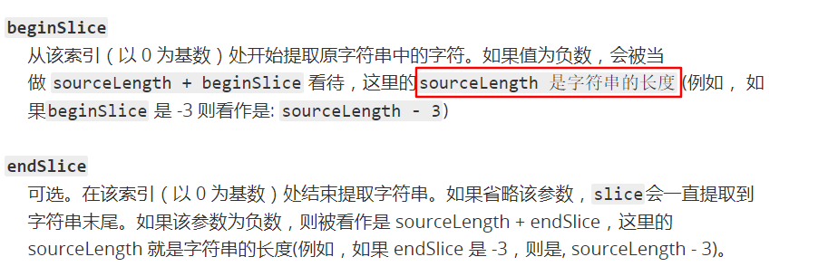
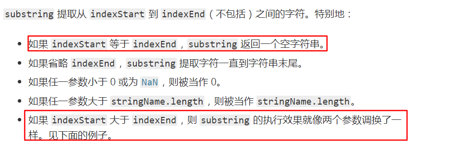
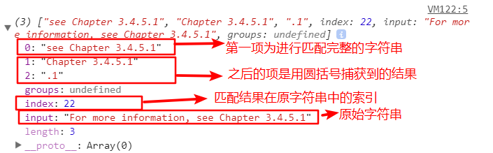

## 基本包装类型
为了便于操作基本类型值，JavaScript还提供了3个特殊的引用类型：`Boolean`,`Number`和`String`。实际上，每当读取一个基本类型值的时候，后台就会创建一个对应的基本包装类型的对象，从而让我们能够调用一些方法来操作这些数据。
```js
var s1 = "some text";
var s2 = s1.substring(2); // "me text"
// 后台创建对应的string包装类型的String对象
```
当第二行代码访问`s1`时，访问过程属于一种读取模式，也就是要从内存中读取这个字符串的值。而在读取模式访中访问字符串时，后台都会完成下列处理。  
1. 创建`String`类型的一个实例
2. 在实例上调用这个方法
3. 销毁实例
可以将以上三个步骤想象成是执行了下列JavaScript代码
```js
var s1 = new String("some text");
var s2 = s1.substring(2); 
s1 = null;
```

使用`new`操作符创建的引用类型的实例，在执行流离开当前作用域之前一直都保存在内存中。而自动创建的基本包装类型的对象，则只存在一行代码执行的瞬间，然后立即被销毁。这意味着我们不能在运行时为基本类型值添加属性和方法。
```js
var s1 = "some text";
s1.color = "red";
console.log(s1.color); // undefined
```

### [字符串的操作方法](https://developer.mozilla.org/zh-CN/docs/Web/JavaScript/Reference/Global_Objects/String/prototype)
* (1) `chartAt()`:从一个字符串中返回指定的字符（根据索引查字符）
* (2) `chartCodeAt()`:返回给定索引的字符的`Unicode`的值
* (3) `concat()`:用于将一或多个字符串拼接起来，返回拼接得到的新字符串(用+更加便捷)
  ```js
  var str = 'hello ';
  var result = str.concat('world');
  console.log(result); // 'hello world'
  console.log(str); // 'hello'  不会改变原字符串
  ```
* (4) `slice()`:提取一个字符串的一部分，并返回一新的字符串，不会改变原来的字符串
  ```js
  // 语法
  slice(beginSlice, endSlice)
  // 创建一个新字符串
  var str1 = "The morning is upon us.";
  str1.slice(4,-2);
  console.log(str2); // OUTPUT: morning is upon u
  ```
  

* (5) `substr()`:返回一个字符串从指定位置开始到指定字符数的字符
  ```js
  // 语法
  str.sbustr(start,length);
  var str = 'abcdefghij';
  console.log(str.substr(1,2)); // "bc"
  console.log(str); // 'abcdefghij' 不会改变原字符串
  ```

* (5) `substring()`:返回一个字符串在开始索引到结束索引之间的一个子集，或从开始索引直到字符串的末尾的一个子集
  ```js
  // 语法
  str.substring(indexStart,indexEnd)
  var anyString = "Mozilla";
  // OUTPUT:"Moz"
  console.log(anyString.substring(0,3));
  console.log(anyString.substring(3,0));
  console.log(anyString); // "Mozilla"
  ```
  
* (6) `indexOf()`:从字符串对象中返回首个被发现的给定值的索引值，如果没有找到则返回-1
* (7) `lastIndexOf()`:从字符串对象中返回最后一个被发现的给定值的索引值，如果没有找到则返回-1;
* (8) `trim()`:从一个字符串的俩端删除空白字符。
* (9) `toLowerCase()`:调用该方法的字符串值将转为小写形式，并返回
* (10) `toUpperCase()`:调用该方法的字符串值将转为大写形式，并返回
* (11) `match()`:当一个字符串与一个正则表达式匹配时，match()方法检索匹配项
  ```js
  var str = "For more information, see Chapter 3.4.5.1";
  var re = /see (chapter \d+(\.\d)*)/i;
  var found = str.match(re);
  console.log(found);
  ```
  
* (12) `replace`:返回一个由替换值替换一些或所有匹配的模式后的新字符串。模式可以是一个字符串或者一个正则表达式,替换值可以是一个字符串或者一个每次匹配都要调用的函数。原字符串不会改变。
  ```js
  var re = /apples/gi;
  var str = "Apples are round, and apples are juicy.";
  var newStr = str.replace(re,"orange");
  console.log(newStr); 
  // "orange are round, and orange are juicy.";
  ```
* (13) `split()`:使用指定的分隔符字符串将一个`String`对象分割成字符串数组,以将字符串分隔为子字符串,以确定每个拆分的位置
  ```js
  /**
  * @param: separator:分隔符（可以是符号或正则表达式） 
  * @param: limit:限定返回的分割片数量（整数）
  * 如果分割符是空字符的话，则将字符串转为字符数组
  */
  str.split(separator,limit)

  "Webkit Moz O ms Khtml".split("");
  // 输出结果
  //   [
  //   "W",
  //   "e",
  //   "b",
  //   "k",
  //   "i",
  //   "t",
  //   " ",
  //   "M",
  //   "o",
  //   "z",
  //   " ",
  //   "O",
  //   " ",
  //   "m",
  //   "s",
  //   " ",
  //   "K",
  //   "h",
  //   "t",
  //   "m",
  //   "l"
  // ]
  ```