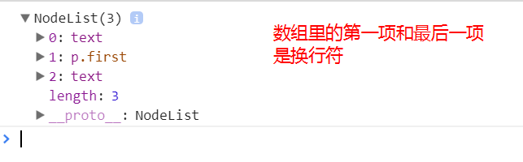
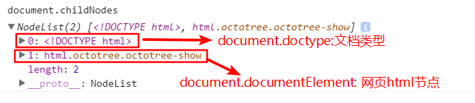

## DOM

> DOM 是 JavaScript 操作网页的接口,全称为"文档对象模型"。它的作用是将网页转换为 JavaScript 对象,从而可以用脚本进行各种操作（比如增删内容）。  
> 浏览器会根据 DOM 模型,将结构化文档(比如 HTML 和 XML)解析成一系列的节点,再由这些节点组成一个树状结构(DOM Tree)。所有的节点和最终的树状结构,都有规范的对外接口。

### 节点

> 所有 DOM 节点都继承了 Node 接口,拥有一些共同的属性和方法。这是 DOM 操作的基础。

DOM 的最小组成单位叫做节点(node)。文档的树形结构（DOM 树），就是由各种不同类型的节点组成。每个节点可以看成是文档树的一片叶子。

节点的类型有七种

```js
Document:整个文档树的顶层节点
DocumentType: doctype标签(比如<!DOCTYPE html>)
Element: 网页的各种HTML标签(比如 <body>, <a>等)
Attribute: 网页元素的属性(比如class="right")
Text: 标签之间或标签包含的文本
Comment: 注释
DocumentFragment: 文档的片段
```

浏览器提供一个原生的节点对象`Node`,上面这 7 种节点都继承了`Node`,因此具有一些共同的属性和方法。

### Node 属性

#### nodeType

`nodeType`属性返回一个整数值，表示节点的类型。

不同节点的`nodeType`属性值和对应的常量，开发人员最常用的就是元素和文本节点.  


经常用`nodeType`属性来确定节点类型：

```js
var node = document.documentElement.firstChild
if (node.nodeType === Node.ELEMENT_NODE) {
  // 在ie中无效
  console.log('node is an element')
}
// 为了确保跨浏览器兼容,最好还是将nodeType属性与数字值进行比较
if (node.nodeType === 1) {
  // 适用于所有浏览器
  console.log('node is an element')
}
```

#### nodeName 和 nodeValue 属性

> nodeName: 显示节点的名称
> nodeValue: 显示节点的值

对于元素节点，`nodeName`中保存的始终都是元素的标签名，而`nodeValue`的值始终为`null`

```js
if (node.nodeType === 1) {
  // 如果是元素节点
  value = node.nodeName // nodeName的值是元素的标签名
}
```

### 节点关系

`childNods`返回一个类似数组的对象(`NodeList`集合)，成员包括当前节点的所有子节点。除了元素节点，`childNode`属性的返回值还包括文本节点和注释节点。如果当前节点不包括任何子节点，则返回一个空的`NodeList`集合。

```js
// html代码
// <div id="node">
//   <p class="first">123</p>
// </div>
var node = document.getElementById('node')
console.log(node.childNodes)
```

打印结果如下:  

`hasChildNodes()`:在节点包含一或多个子节点的情况下返回`true`。子节点包括所有节点，哪怕节点只包含一个空格，`hasChildNodes()`也会返回`true`.

```js
// 判断一个节点有没有子节点
node.hasChildNodes()
node.firstChild !== null
node.childNodes && node.childNodes.length > 0
```

### 节点操作

`appendChild`方法接受一个节点对象作为参数,将其作为最后一个子节点,插入当前节点。该方法的返回值就是插入文档的子节点。

```js
// 新家p标签插入到body的尾部
var p = document.createElement('p')
var returnValue = document.body.appendChild(p)
console.log(returnValue === p) // true
console.log(document.body.lastChild === p) // true
```

如果参数节点是 DOM 已经存在的节点,`appendChild`方法会将其从原来的位置**移动**到新位置。

```js
var element = document
  .createElement('div')
  .appendChild(document.createElement('b'))
console.log(element) // <b></b>
```

`insertBefore`方法用于将某个节点插入父节点内部的指定位置。  
`var insertedNode = parentNode.insertBefore(newNode,referenceNode)`;
`insertBefore`方法接受俩个参数，第一个参数：所要插入的节点`newNode`,第二个参数是父节点`parentNode`内部的一个子节点`referenceNode`。`newNode`将插入到`referenceNode`这个子节点的前面，返回值是插入的新节点`newNode`。

```js
// 在body标签的第一个子节点之前插入p标签
var p = document.createElement('p')
var returnValue = document.body.insertBefore(p, document.body.firstChild)
console.log(returnValue === p) // true
```

* 注意点：
  1.  `insertBefore`的第二个参数不能省略。
  2.  `insertBefore`的第二个参数如果是`null`,则新节点将插在当前节点内部的最后位置，变成最后一个子节点(相当于`appendChild`)
  3.  如果所插入的节点是当前`DOM`现有的节点，则该节点将从原有位置移除，插入新的位置

`replaceChild`方法用于将一个新的节点，替换当前节点的某一个子节点。

```js
/**
 * @desc 将一个新的节点，替换当前节点的某一个子节点
 * @param newChild 用来替换的新节点
 * @param oldChild 将要替换走的节点
 * @return oldChild 替换走的那个节点
 */
var replaceNode = parentNode.replaceChild(newChild, oldChild)
```

`removeChild`方法接受一个子节点作为参数，用于从当前节点移除该子节点。返回值是移除的子节点。

```js
/**
 * @desc
 *   从当前节点移除该子节点
 * @param 子节点
 * @return 移除的子节点
 */
var divA = document.getElementById('A')
divA.parentNode.removeChild(divA)
```

### document 对象

> document 对象是文档的根节点,每张网页都有自己的`document`对象。`window.document`属性就指向这个对象。只要浏览器开始载入 HTML 文档,该对象就存在了,可以直接使用,可以直接使用。

`document`对象有不同的方法可以来获取:

```js
正常的网页：直接使用document或者window.document
iframe框架里面的网页,使用iframe节点的contentDocument属性
Ajax操作返回的文档,使用XMLHTTPRequest对象的responseXML属性
内部节点的ownerDocument属性
```

`documnet.documentElement`属性返回当前文档的根节点(root)。它通常是`document`节点的第二个子节点,紧跟在`document.doctype`节点后面。HTML 网页的该属性,一般是`<html>`节点。

`document.body`属性指向`<body>`节点,开发人员要经常使用这个元素.

```js
var body = document.body // 取得对body的引用
```

也可以通过`childNodes`列表访问文档元素  


#### 文档静态信息属性

以下属性返回文档信息.

* (1)document.URI,documentURL,document.domain

  ```js
  // 文档网络地址：http://javascript.ruanyifeng.com/dom/document.html
  document.URL === document.URI
  // "http://javascript.ruanyifeng.com/dom/document.html"

  document.domain // 返回当前文档的域名
  // "javascript.ruanyifeng.com"
  ```
