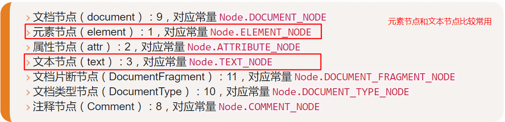

## DOM
> DOM是JavaScript操作网页的接口,全称为"文档对象模型"。它的作用是将网页转换为JavaScript对象,从而可以用脚本进行各种操作（比如增删内容）。  
> 浏览器会根据DOM模型,将结构化文档(比如HTML和XML)解析成一系列的节点,再由这些节点组成一个树状结构(DOM Tree)。所有的节点和最终的树状结构,都有规范的对外接口。

### 节点
> 所有DOM节点都继承了Node接口,拥有一些共同的属性和方法。这是DOM操作的基础。

DOM的最小组成单位叫做节点(node)。文档的树形结构（DOM树），就是由各种不同类型的节点组成。每个节点可以看成是文档树的一片叶子。

节点的类型有七种
```js
Document:整个文档树的顶层节点
DocumentType: doctype标签(比如<!DOCTYPE html>)
Element: 网页的各种HTML标签(比如 <body>, <a>等)
Attribute: 网页元素的属性(比如class="right")
Text: 标签之间或标签包含的文本
Comment: 注释
DocumentFragment: 文档的片段
```
浏览器提供一个原生的节点对象`Node`,上面这7种节点都继承了`Node`,因此具有一些共同的属性和方法。

### Node属性
#### nodeType
`nodeType`属性返回一个整数值，表示节点的类型。

不同节点的`nodeType`属性值和对应的常量，开发人员最常用的就是元素和文本节点.  


经常用`nodeType`属性来确定节点类型：
```js
var node = document.documentElement.firstChild;
if(node.nodeType === Node.ELEMENT_NODE) { // 在ie中无效
  console.log("node is an element");
}
// 为了确保跨浏览器兼容,最好还是将nodeType属性与数字值进行比较
if(node.nodeType === 1) { // 适用于所有浏览器
  console.log("node is an element");
}
```

#### nodeName和nodeValue属性
对于元素节点，`nodeName`中保存的始终都是元素的标签名，而`nodeValue`的值始终为`null`
```js
if(node.nodeType === 1) { // 如果是元素节点
  value = node.nodeName;  // nodeName的值是元素的标签名
}
```

