## 常用网站
1. 查英文单词: iciba.com  
  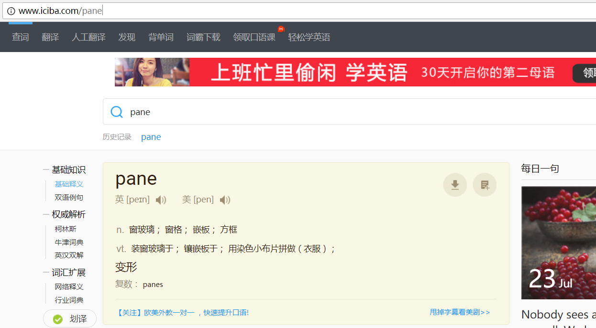
2. `CSS`浏览器兼容性查询: caniuse.com  
  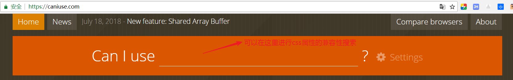
3. 前端开发中文文档导航: cndevdocs.com  
  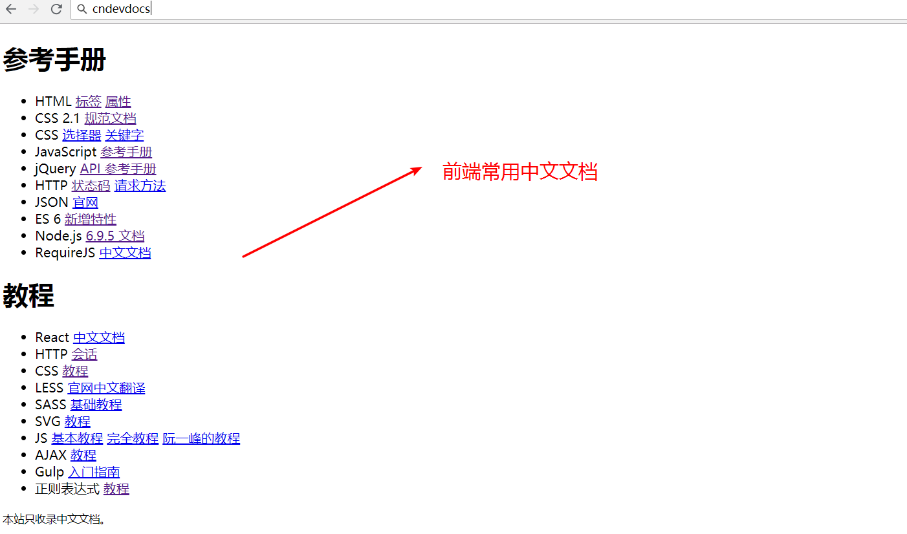
4. 阿里字体图标库: iconfont.cn  
  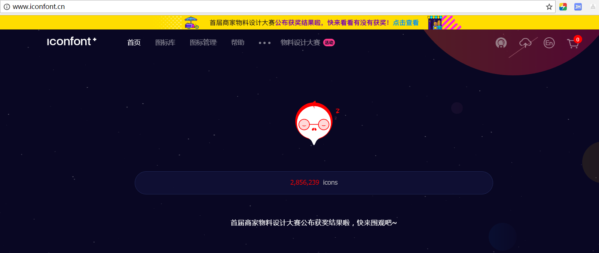

## 常用编辑器设置及快捷键

### `webStorm`
1. 查找文件  
    全局搜索：
    1. `ctrl+shift+f`: 全局搜索项目中的任意代码
    2. 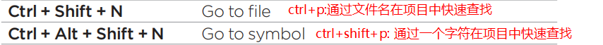
    3. `shift+shift`: 全局搜索任意内容（代码，编辑器功能，文件）
    4. `ctrl+shift+a`: 快速查找并使用编辑器的所有功能
    局部搜索：
#### 常用快捷键
#### [常用设置](https://juejin.im/entry/599ad8f26fb9a0249174ef09)
1. `Allow unsigned requests`:允许为签名的请求  
  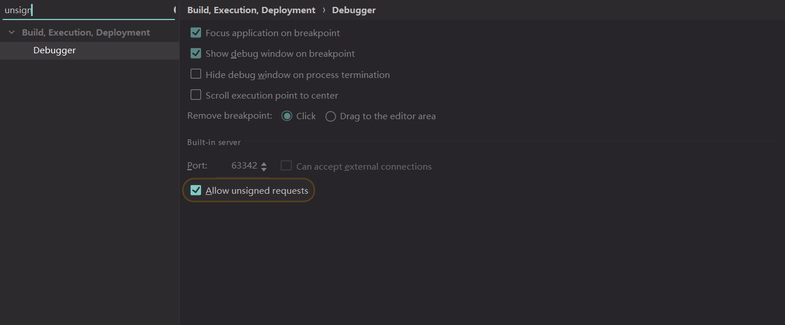
2. 设置修改文件手动保存，并添加未保存时的图标样式
   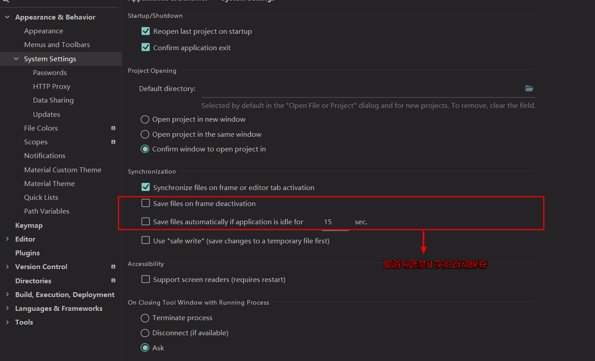  
3. 设置js格式化风格（目前常用为`JavaScript Standard Style）
  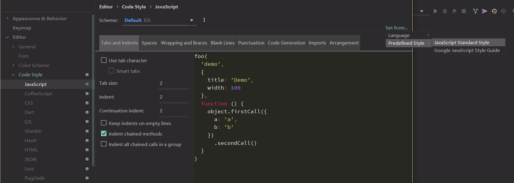
4. 关闭安全写入  
  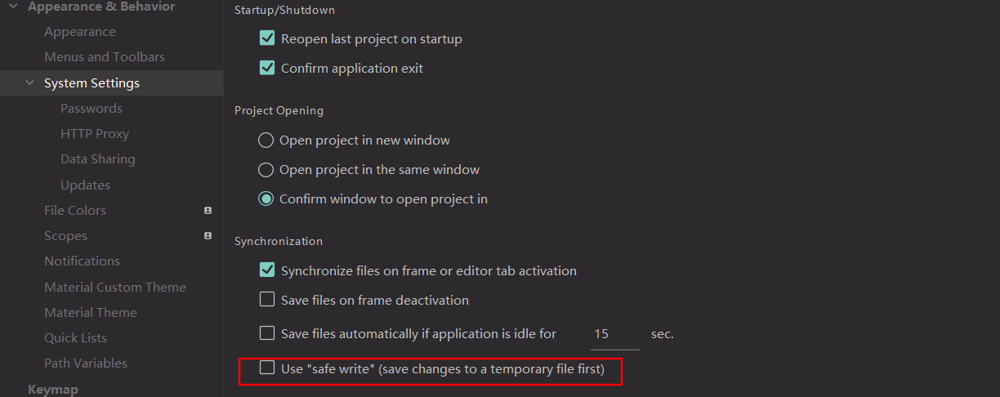  
  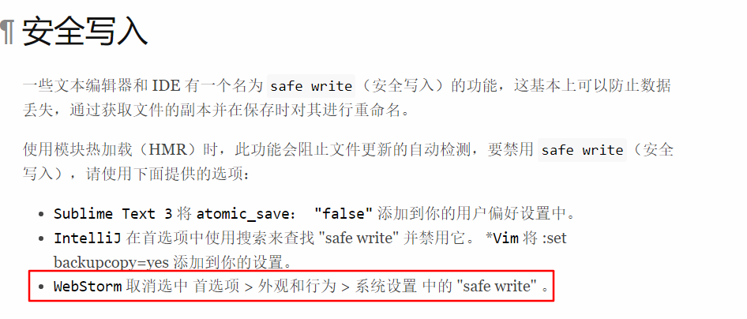
5. 可以鼠标双击选中驼峰式命名的变量  
    修改设置之后就可以直接双击选中input-wrapper,否则只能选中input或wrapper
    ```html
    <div class="input-wrapper"></div>
    ```
   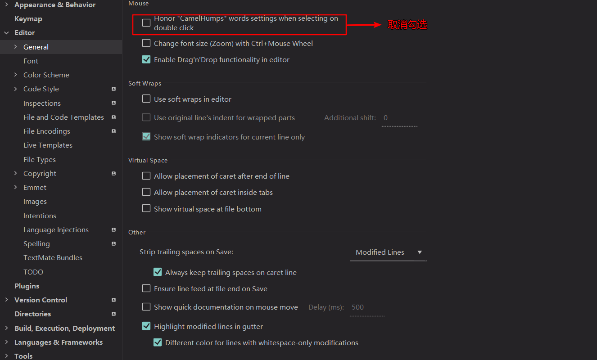  
   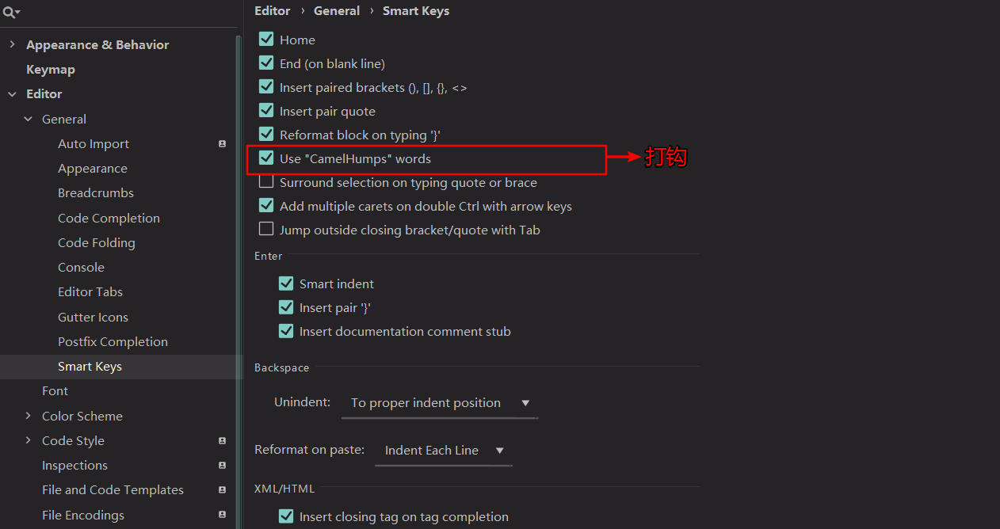